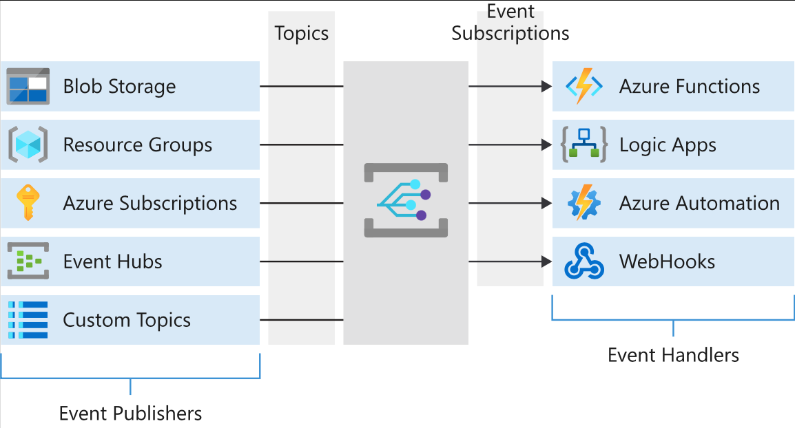

# Respond to Azure events by using Event Grid

## What is Event Grid?

* A service that manages the **routing and delivery of events** from many **sources** and **subscribers**.
* This process eliminates the need for polling, and results in minimized cost and latency.
* **Event publishers** and **subscribers** are decoupled by using the publisher/subscriber pattern.

## Capabilities

Event Grid doesn't require provisioning or managing. It's native to Azure, with the ability to be extended and customized. Some of the main advantages are:

* Point and click in the Azure portal to **add and collect your events from Azure resources**.
* Can **filter events**. Filter events so that **handlers receive only relevant events**.
* **Supports multiple subscribers**. Attach multiple handlers to a single event from a single source.
* **Reliable**. Take advantage of 24-hour retries to ensure events are delivered.
* **Throughput is high**. Handle a high volume of events, in the range of **millions per second**.
* It has **built-in events**. Use built-in events to get started quickly and easily.
* It supports **custom events**. Use Event Grid to reliably deliver events for your custom components.

## 1. Event sources and event handlers

### Event Sources

* Azure offers many event sources or publishers. For example, **Azure Storage is the event source for blob-created events**.
* Sources **can be configured from anywhere**, and include **on-premises** custom applications or virtual machines within your Azure account.

### Event handlers

* There are **event handlers for many services** in Azure, and more are being added all the time.
* You can also **use a webhook handler** to call a **custom endpoint outside Azure**.

#### Some examples of event handlers within Azure are:

* Azure Functions
* Azure Logic Apps
* Azure Automation
* Azure Event Hubs
* Azure Service Bus

## 2. Topics and event subscriptions

Topics provide the core mechanism for managing the various events being raised throughout your system's life cycle. Think of them as **subject areas that define the topic of a conversation**.

You **can create as many topics as you need in Event Grid** to provide the granularity required to manage events in your system.

When the topics have been defined, you **can subscribe to them**. Subscriptions convey which events on a topic you're interested in receiving. These events can then be filtered by type or subject.
