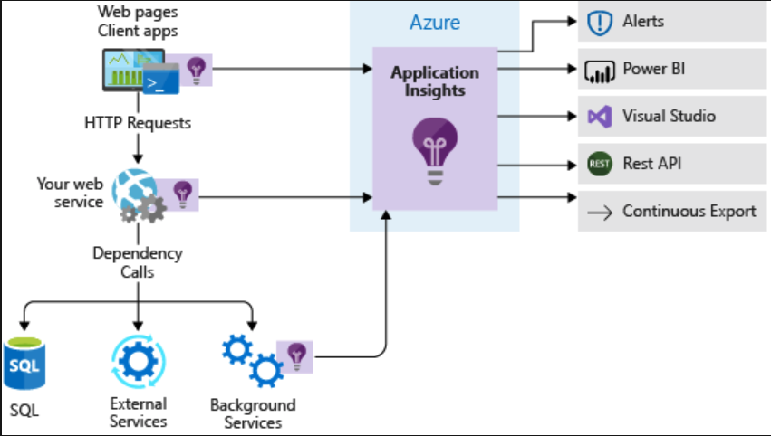

# Introduction

You can use the **Application Insights SDK** in your web app's code to

* Track custom events
* Track custom metrics
* Automatically capture detailed telemetry about **performance** and **behavior**

To use the Application Insights SDK, you need to reference a package or library and add configuration and code to your app.

## What is the Application Insights SDK?

A software package you reference and use in your application's code. The **SDK hooks into the web application framework** that powers your app and automatically **captures detailed runtime information**, **including data about HTTP requests**, **system metrics**, **service dependencies**, and **exceptions**. It also lets you add code to record information about **events** and **metrics** that are specific to the business domain of your app.

The SDK **sends this telemetry data to an Application Insights** resource in Azure. The Application Insights service processes and aggregates the data into a form that's easy to query and visualize.

Use of the SDK is not limited to web applications. You **can instrument any kind of service or component** for which you want to record telemetry, though most of the data that the SDK can record automatically is specific to web apps. And the SDK isn't limited to applications that are deployed to Azure.

## Why install the SDK?

The Application Insights SDK provides these benefits:

* **Comprehensive data collection:** Data like **user retention**, **unique users**, and **unique sessions** is available in Application Insights **only when you use the Application Insights SDK**.
* **Custom telemetry:** With the SDK, you can **add code to your application** to capture **events** and **metrics** that are specific to your app and its business domain.
* **Advanced features:** Some Application Insights features are **available only when you use the SDK**. For example, **Live Metrics Stream** lets you watch and drill down into metrics in real time.
* **Local telemetry in Visual Studio:** Telemetry data from applications instrumented with the SDK can be viewed locally in Visual Studio when you run the app in the debugger.

### Runtime instrumentation

Azure **App Service** lets you enable Application Insights for an application **without adding the SDK to your code**. This feature, called runtime instrumentation, **doesn't offer deep insight** into your app the way the SDK can.

Runtime instrumentation is also an Azure-specific feature and is **available only for Windows-based web apps**. The SDK can be used to instrument any application, service, or component running anywhere.

## Customized insights

### Common events and metrics

When you configure and initialize the SDK in your code, it tracks common events and metrics of all web apps:

* Request and response metrics
* HTTP queue lengths
* Performance counters like CPU and memory utilization

### Custom events and metrics

Most applications will have **domain-specific events and metrics** that you'll be interested in.

For example:

* How often do users watch a whole video?
* How often do users stop a video before its end?
* How often does buffering interrupt a video?
* On average, how many videos are being viewed at the same time during each hour of the day?

### Add code to your app for custom events and metrics

You can add code to your app that uses the SDK to record these events in Application Insights. You can then monitor these events and present summaries about them in Application Insights.

## How to use the SDK

Assuming you already have a web app and an Application Insights resource in Azure, to install the SDK in your web app project, you need to:

1. Reference the SDK in your app.
2. Configure your app with the instrumentation key of your Application Insights resource.
3. Initialize the SDK in code to begin generating telemetry.

The exact steps you'll need to take depends on the tools, programming language, and application framework you're using.

### 1. Install the SDK package (in ASP.NET Core application)

The following **dotnet** command adds a reference to the **Microsoft.ApplicationInsights.AspNetCore** NuGet package to an ASP.NET Core app from the command line. This package includes the **base Application Insights SDK and libraries that make it easy** to use from ASP.NET Core applications.

> dotnet add package Microsoft.ApplicationInsights.AspNetCore

### 2. Configure the instrumentation key

Every Application Insights resource in Azure is **uniquely identified by a GUID instrumentation key.**

Applications that use the SDK to send telemetry data need to be configured with the instrumentation key of the Application Insights resource to which the data should be sent.

#### How to find Instrumentation key:

Using Azure Portal

1. Navigate to Application Insights's **Overview** page
2. Find the **Instrumentation key**

Using Azure CLI command

> **az resource show** \
    --resource-group <resource_group_name> \
    --name <resource_name> \
    --resource-type "Microsoft.Insights/components" \
    --query **properties.InstrumentationKey**

### Configure in APS.NET core

Two methods of configuring it:

1. **Configuration file:**

    1.1 In the _appsettings.json_ file, create a section called **ApplicationInsights**
    1.2 Add a new configuration value called **InstrumentationKey**, like so.

> {
>   "ApplicationInsights": {
>      "InstrumentationKey": "11111111-2222-3333-4444-555555555555"
>   }
> }

2. **Environment variable:**

    * Create an environment variable called **APPINSIGHTS_INSTRUMENTATIONKEY** that contains the value of the key.
    * This value needs to be present in the environment when the application is started.
    * For apps deployed to Azure App Service, you create an environment variable by configuring an application setting. If you enable runtime instrumentation in an App Service web app, Azure will automatically create the setting with the correct value.

## Initialize the SDK in code

Finally, you must initialize Application Insights in your web app.

ASP.NET Core applications start up by:

1. Calling **CreateWebHostBuilder()** in **Program.cs**. You can configure many aspects of the application and the runtime by chaining additional method calls here, including Application Insights.
2. A call to **UseApplicationInsights()** will load your instrumentation key from configuration:
    * Trigger the SDK to **automatically generate** telemetry about many application **events**
    * Enable access to a TelemetryClient object from controllers and other components for **custom event** and **metric** tracking.

Here's what the relevant section of Program.cs will look like after you initialize Application Insights.

> public static IWebHostBuilder CreateWebHostBuilder(string[] args) =>
    WebHost.CreateDefaultBuilder(args)
        .UseApplicationInsights()
        .UseStartup<Startup>();
