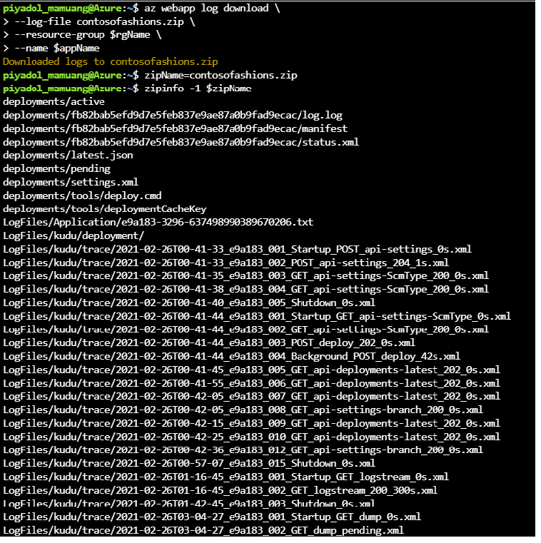
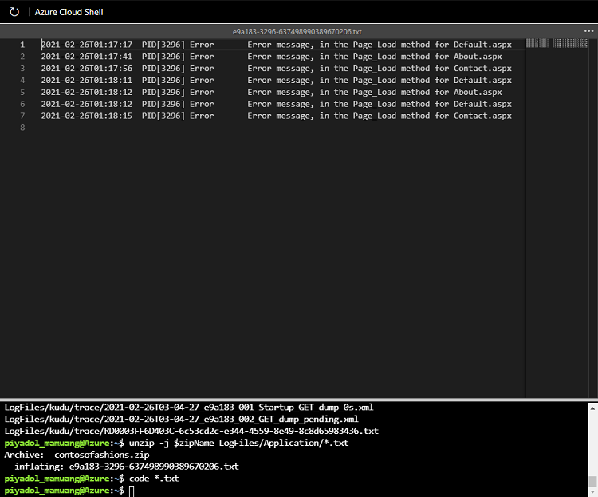

# Retrieve application log files

## Log file storage locations

### Windows app log files

#### 1. File system
Log files are stored in a virtual drive that is associated with your Web app.

> D:\Home
> D:\Home\LogFiles

File Path | Contains | Have/has been enabled
--------- | ------------ | -------------
D:\Home\LogFiles\Application | Application-generated messages | **File System** application logging
D:\Home\LogFiles\DetailedErrors | Detailed Web server error logs | **Detailed** error messages
D:\Home\LogFiles\http | IIS-level logs | **Web server logging**
D:\Home\LogFiles\W3SVC | Details of all failed https requests | **Failed request tracing**

#### 2. Blob storage

Logs are stored in year, month, date, and hour folders, for example:

>2019
>-01
>--10
>--08 - log entries for the period 08:00:00 to 08:59:59 on January 10th 2019
>--09 - log entries for the period 09:00:00 to 09:59:59 on January 10th 2019

Within the hour folder, there will be one or more CSV files containing messages saved within that 60-minute period.

### Linux app log files

Messages are stored in Docker log files. To see messages logged by underlying processes you will need to open an SSH connection to the Docker container.

## Methods for retrieving log files

### File system

you can use the Azure CLI or the Kudu console.

#### 1 Azure CLI

To download log file to your local computer:
> **az webapp log download** --log-file \<_filename_\>.zip  --resource-group \<_resource group name_\> --name \<_app name_\>

Example log files:

> Note!
> The Azure CLI download includes all app logs, except for failed request traces.

#### 2. Kudu

**For Windows apps** you can browse to the log file location, and then download the logs.
**For Linux apps**, there may be a download link.

##### 2.1 Access Kudu Console

1. Using Kudu console

    1. Access Kudu console via **https://[app name].scm.azurewebsites.net**
    2. Sign in using **deployment credentials** (See more on View live application logging with the log steaming service)

2. Using Azure Portal

    1. Navigate to your App service in Azure Portal
    2. Under Development Tools section, select **Advanced Tools**
    3. On the Advanced Tools pane, to open a new Kudu Services tab, select **Go**

##### 2.2 To download the log files from Windows apps

1. Select Debug Console, and then select CMD.
2. In the file explorer section, select LogFiles, and for the Application folder, select Download; the logs will be downloaded to your computer as Application.zip.

##### 2.3 To download the log files from Linux apps

Select the download link on the Environment page.For Linux apps, select the download link on the Environment page.

### Blob storage

Access using the same way that you access blob storage

1. Azure Powershell
2. Azure CLI
3. API
4. Azure Storage Explorer
5. Azcopy
