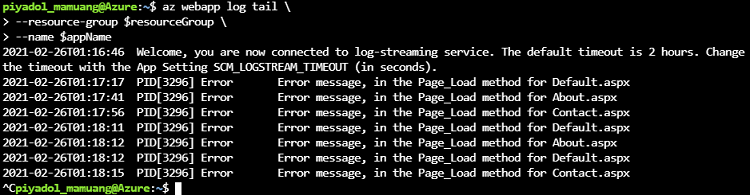

# View Live Application Logging with the Log Streaming Service

## What is live log streaming

* way to view live logs for troubleshooting purposes
* designed to provide a quick view of all messages that are being sent to the app logs in the file system
* without having to go through the process of locating and opening these logs

To use live logging, you connect to the live log service from the command line, and can then see text being written to the app's logs in real time.

## What logs can be streamed

The log streaming service adds a redirect from the file system logs, so you'll see the same information as is saved to those log files.

## Typical scenarios for using live logging

* **For initial debugging**, log messages show in real time to give you quick feedback on code or server issues. You can then make a change, redeploy your app, and instantly see the results.
* **Connects to only one app instance**, so is not useful if you have a multi-instance app
* **Limited use** as you scale up your apps

## How to use live log streaming

### 1. Azure CLI

#### 1.1 To open log stream using CLI

> az webapp log tail --name <app name> --resource-group <resource group name>

#### 1.2 To close log stream using CLI

> Ctrl+C

Example log streaming using Azure CLI

> Note!
> You've deployed the following code on your web app.
> logger.LogInformation("Information message from OnGet method on Index.cshtml page");
> logger.LogDebug("Debug message from OnGet method on Index.cshtml page");
> logger.LogError("Error message from OnGet method on Index.cshtml page");
> logger.LogWarning("Warning message from OnGet method on Index.cshtml page");
> logger.LogTrace("Trace message from OnGet method on Index.cshtml page");
> logger.LogCritical("Critical message from OnGet method on Index.cshtml page");

### 2. Curl

#### FTPS credentials

To use Curl, you need FTPS credentials. There are **two types of FTPS credentials**:

* **Application scope**. Azure automatically creates a username/password pair when you deploy a Web app, and each of your apps has their own separate set of credentials.
* **User scope**. You can create your own credentials for **use with any Web app**; you can manage these credentials in the Azure portal, as long as you already have at least one Web app, or by using Azure CLI commands.

#### To find FTPS credentials

1. Navigate to your App Service in Azure Portal
2. Navigate to **Deployment Center** blade, on left hand side menu, under Deployment section
3. Select **FTPS credentials** tab

You will be able to see username/password under *Application scope**.
For **User scope**, you need to create manually by using following command.

> az webapp deployment user set --user-name <name-of-user-to create> --password <new-password>

#### 2.1 To open log stream using Curl

> curl -u {username} https://{sitename}.scm.azurewebsites.net/api/logstream

You'll be prompted for the password.

#### 2.2 To close log stream

> Ctrl+C
