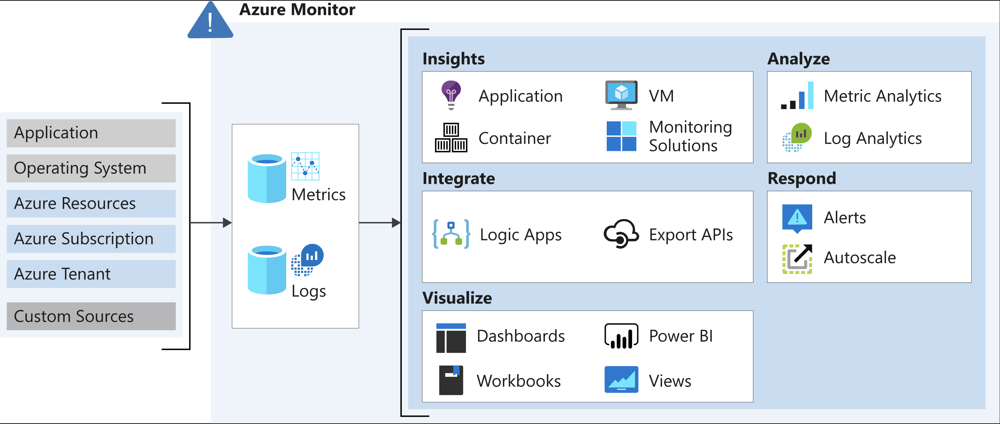

# Features of Azure Monitor logs

## 1. Data collection in Azure Monitor

Azure Monitor collects two fundamental types of data:

* **Metrics**: tell you how the **resource** is **performing**, and the other resources that it's consuming
* **Logs**: contain records that show when **resources** are **created** or **modified**

Collect data from:

* **Application data**: Data that relates to your custom application code.
* **Operating system data**: Data from the Windows or Linux virtual machines that host your application.
* **Azure resource data**: Data that relates to the operations of an Azure resource, such as a web app or a load balancer.
* **Azure subscription data**: Data that relates to your subscription. It includes data about Azure health and availability.
* **Azure tenant data**: Data about your Azure organization-level services, such as Azure Active Directory.

Azure Monitor begins to **collect data from these sources as soon as you create Azure resources**.

You can extend the data that Azure Monitor collects by:

* **Enabling diagnostics**: For **some resources, such as Azure SQL Database, you receive full information about a resource only after you have enabled diagnostic logging** for it.
* **Adding an agent**: For **virtual machines**, you can install the Log Analytics agent and configure it to send data to a **Log Analytics workspace**. This agent increases the amount of information that's sent to Azure Monitor.

## 2. Logs

* Logs **contain time-stamped** information about **changes** made to **resources**.
* The log data is organized into **records**, with different sets of properties for each type of record.
* The logs **can include numeric values** such as Azure Monitor metrics, but **most include text data rather than numeric** values.
* Can store **metric data** in logs to combine them with other monitoring data for analysis.

### Events

* The most common type of log entry records an **event**.
* Occur **sporadically** rather than at fixed intervals or according to a schedule.
* Created by applications and services

### Log Analytic workspace

* You log data from Azure Monitor in a Log Analytics workspace.
* Analytic engine
* Rich query language.T
* Show the context of any problems and are useful for identifying root causes.

## 3. Metrics

* Are **numerical values** that describe some aspect of a system at a **point in time**.
* Azure Monitor can capture metrics in **near real time**.
* Are collected at **regular intervals**
* Useful for **alerting** because of their frequent sampling.
* You can use a variety of algorithms to compare a metric to other metrics and observe trends over time.
* Stored in a **time-series database**, is most effective for analyzing time-stamped data.

## 4. Analyzing logs by using Kusto

* To retrieve, consolidate, and analyze data, you specify a query to run in Azure Monitor logs.
* You write a log query with the Kusto query language, which is also used by Azure Data Explorer.
