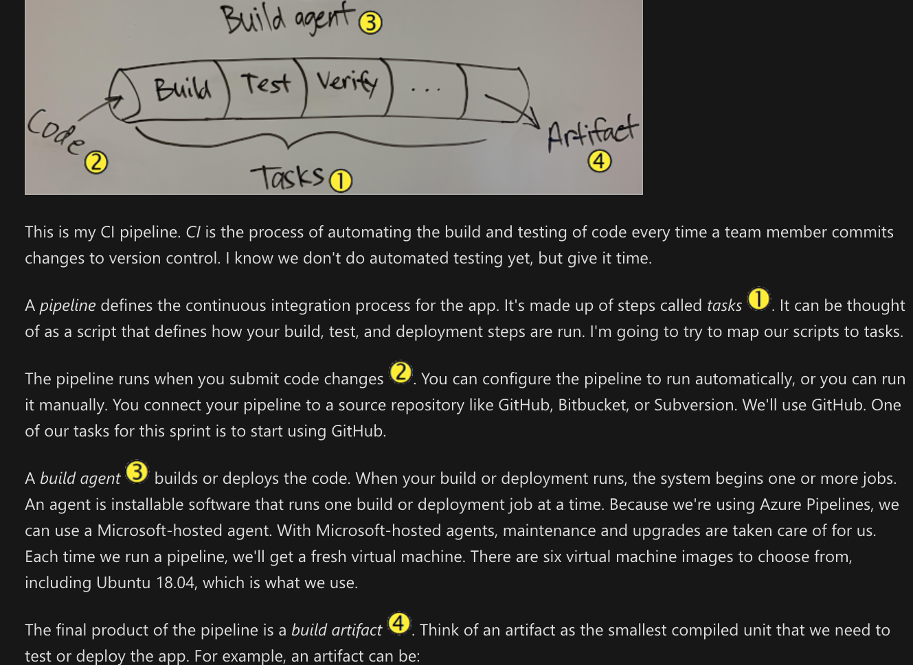

# What is Azure Pipelines?

## Benefit

1. **Build servers:** Azure Pipelines provides **build servers that Microsoft hosts and maintains**, it always has the latest patches and security updates. We won't have to worry about maintaining build servers.
2. **Tasks:** Azure Pipelines comes with a **catalog of tasks**. A task is a packaged script or procedure that's been abstracted with a set of inputs. I'm going to try to map what our build scripts do to those tasks. At least we can standardize how things get done and increase the level of automation.
3. **Support many languages:** Azure Pipelines works with many different languages and app types. If we want to expand in those directions, we won't have to retool.
4. **Notification:** We can set up the pipeline to notify you automatically, either through email or some other notification, when a build is ready. You'll never have to wait for someone to remind you again.

## What is continuous integration?

Continuous integration (CI) is the **process of automating the build and testing** of code every time a team member commits changes to version control.

CI encourages developers to share their code and unit tests by merging their changes into a shared version control repository after every small task completion. Committing code triggers an automated build system to grab the latest code from the shared repository and to build, test, and validate the full master branch (also known as the trunk or main).

1. **Tasks**

    * A pipeline defines the continuous integration process for the app. It's made up of steps called tasks.
    * It can be thought of as a script that **defines how your build**, **test**, and **deployment** steps are run. I'm going to try to map our scripts to tasks.

2. **Trigger**

    * The pipeline runs when you submit **code changes**.
    * You can configure the pipeline to run **automatically**, or you can run it **manually**.
    * You connect your pipeline to a source repository like **GitHub**, **Bitbucket**, or **Subversion**.

3. **Build**

    * A build agent **builds or deploys the code**.
    * When your build or deployment runs, the system begins one or more jobs.
    * An **agent is installable software that runs one** build or deployment job **at a time**.
    * Because we're using Azure Pipelines, we can use a Microsoft-hosted agent. With Microsoft-hosted agents, maintenance and upgrades are taken care of for us.
    * Each time we run a pipeline, we'll get a fresh virtual machine. There are six virtual machine images to choose from, including Ubuntu 18.04, which is what we use.

4. **Artifact**

    * The final product of the pipeline is a build artifact.
    * Think of an artifact as **the smallest compiled unit that we need to test or deploy the app**.
    * For example, an artifact can be:
        * A Java or .NET app packaged into a .jar or .zip file.
        * A C++ or JavaScript library.
        * A virtual machine, cloud, or Docker image.

## Implement and manage build infrastructure

let's discuss a few of the configuration details. Specifically, we'll talk a bit more about build agents, integrating with third-party systems, managing your pipeline configuration, and using concurrent pipelines.

### 1. Build agents

As you know, a build agent is a piece of installable software that runs one build or deployment job at a time. To build your code or deploy your software you need at least one agent. As you add more code and people, you'll eventually need more than one. Let's examine build agents in a bit more depth.

#### 1.1 Differences between implementing hosted and private agents

You can use either a Microsoft-hosted or a private agent. What are the differences?

##### 1.1.1 Microsoft hosted agents

* With Microsoft-hosted agents, **maintenance** and **upgrades** are **taken care of for you**.
* Each time you run a pipeline, you get a **fresh virtual machine**. The virtual machine is discarded after one use.

##### 1.1.2 Private agents (Self-hosted agents)

* An agent that you set up and manage on your own to run build and deployment jobs
* Self-hosted agents give you **more control**
* Let you **install any software** you need for your builds and deployments
* You can install the agent on **Linux**, **macOS**, or **Windows** machines, and **Linux Docker container**
* After you've installed the agent on a machine, you can install any other software on that machine as required by your build or deployment jobs.

### 1.2 Agent pools

* Instead of managing each agent individually, you can organize agents into agent pools.
* An agent pool **defines the sharing boundary for all agents in that pool**
* Agent pools are scoped to the Azure DevOps organization so you **can share an agent pool across projects**.
* A project agent pool provides access to an organization agent pool.
* When you create a build or release pipeline, **you specify which pool it uses**.
* Pools are scoped to your project so you **can only use them across build and release pipelines within a project**.

* To **share an agent pool with multiple projects**, in each of those projects, **you create a project agent pool pointing to an organization agent pool**.
  * Multiple pools **across** projects **can** use the same organization agent pool
  * Multiple pools **within** a project **cannot** use the same organization agent pool
  * Each project agent pool can use only one organization agent pool

### 1.3 Agent queues

If you are a project team member, you create and manage agent build queues from the agent pools tab in project settings.

### 2. Service endpoints for integration with third-party systems

Service endpoints are a **way for Azure DevOps to connect to external systems or services**. They are a bundle of securely stored properties that includes but is not limited to:

* Service name
* Description
* Server URL
* Certificates or tokens
* User names and passwords

Extensions are then able to access the service endpoint to get the stored details to perform the necessary operations on that service.

### 3. Concurrent pipelines

You can run concurrent pipelines (also called parallel jobs) in Azure Pipelines. One parallel job in Azure Pipeline lets you run a single build or release job at any given time. This rule is true whether you run the job on Microsoft-hosted or self-hosted agents. Parallel jobs are purchased at the organization level, and they are shared by all projects in an organization.

#### 3.1 Microsoft-hosted CI/CD

##### 3.1.1 Microsoft-hosted agents

If you want to run your builds and releases on machines that Microsoft manages, use Microsoft-hosted parallel jobs. Your jobs run on the pool of hosted agents.

Microsoft provides a free tier of service by default for every organization. Consult the Azure DevOps documentation to see the criteria.

##### 3.1.2 Private-agents

* If you want Azure Pipelines to orchestrate your builds and releases, but use your own machines to run them, use self-hosted parallel jobs.
* You start by deploying agents on your machines. **You can register any number of these self-hosted agents in your organization**.
* Microsoft **charges based on the number of jobs you want to run at a time**, not the number of agents registered.

#### 3.2 Plan a strategy for concurrent pipelines

Here are some steps to take to plan for concurrent pipelines.

##### 3.2.1 Determine how many parallel jobs you need

Begin by seeing if the free tier offered in your organization is enough for your teams. When you've reached the per-month limit for the free tier of Microsoft-hosted parallel jobs, you can start by buying one parallel job. As the number of queued builds and releases exceeds the number of parallel jobs you have, your build and release queues will grow longer. When you find the queue delays are too long, **you can purchase additional parallel jobs as needed**.

A simple rule of thumb is to estimate that **you'll need one parallel job for every four to five users** in your organization.

##### 3.2.2 Think about your scenario

Here are some examples of where you might need multiple parallel jobs.

* If you **have multiple teams**, and if each of them **requires a CI build**, you'll likely need a parallel job for each team.
* If your **CI build trigger applies to multiple branches**, you'll likely need a parallel job for each active branch.
* If you **develop multiple apps** by using one organization or server, you'll likely need additional parallel jobs, one to deploy each app at the same time.
