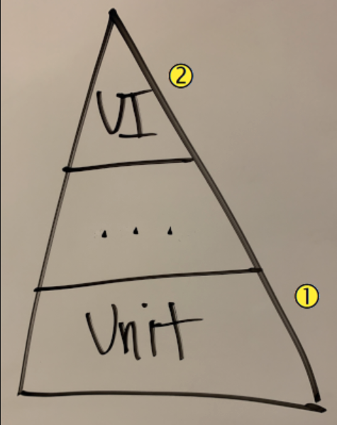

# What is automated testing?

Automated testing **uses software to execute your code** and **compare the actual results with the results you expect**. Compare this with exploratory or manual testing, where a human typically follows instructions in a test plan to verify that software functions as expected.

Manual testing has its benefits. But as your code base grows in size, testing all features manually (including edge cases) can become repetitive, tedious, and error prone. Automated testing can help eliminate some of this burden and enable manual testers to focus on what they do best: ensuring that your users will have a positive experience with your software.

## The test pyramid

When we think about automated testing, it's common to separate tests into layers. Mike Cohn proposes this concept, known as the test pyramid, in his book Succeeding with Agile.

The concept illustrates that you focus most of your effort on writing tests that verify the foundational levels of your software (callout 1 in the pyramid) such as:

* Functions
* Classes
* Methods

You focus progressively less effort as features are combined, such as:

* User interface (UI) layer

The idea is that if

* **You can verify that each lower-level component works as expected** in **"isolation"**
* Tests at the higher levels need only verify that multiple components work together to get the expected result.

## When should I write tests?

The answer mainly **depends on your needs** and experience in writing tests.

**It's never too late** to start adding tests for code you've already written and deployed. This is especially true for features that often break or require the most effort from your test team.

When you relate testing to continuous integration and continuous delivery pipelines, two concepts you'll hear about are continuous testing and shifting left.

### Continuous testing

* **Tests** are run early in the **development process**
* As **every change** moves through the **pipeline**

### Shifting left

* Considering **software quality and testing** earlier in the **development process**
* Often **requires testers to get involved in the design process**, even before any code for the feature is written.

As an example, developers often add test cases as they develop their feature and run the entire suite of tests before they submit the change to the pipeline. This approach helps ensure both that the feature they're building behaves as expected and that it doesn't break existing features.

## The tradeoff

Although automated testing enables testers to focus their time verifying the end-user experience, **developers might need to dedicate more time to writing and maintaining their test code**.

However, the **point of automated testing** is to **help ensure that testers receive only the highest quality code**, code that's been proven to function as expected. Therefore, **developers can reclaim some of their time by having to handle fewer bugs or avoiding code rewrites** because of an edge case they hadn't originally considered.

## Added benefits

Documentation and the ability to more easily refactor your code are two added benefits of automated testing.

### Documentation

Manual test plans can **serve as a type of documentation as to how software should behave and why certain features exist**.

Automated tests can serve the same purpose. **Automated test code often uses a human-readable format**. The set of inputs you provide represent values your users might enter. Each associated output specifies the result your users should expect.

#### Test-driven development (TDD)

* By writing their **test code before implementing** a new feature.
* The idea is to **write a set of tests**, often called **specs**, that **initially fail**. Then, the developer incrementally writes code to implement the feature until all tests pass.
* Ensure that only the necessary amount of code is written to implement the feature.

### Refactoring

Automated tests serve as a type of contract. That is, you specify the inputs and the expected results.

**When you make a change, all you need to do is run your tests and verify that they continue to pass.** After you've met your refactoring goals, you can submit your change to the build pipeline so that everyone can benefit, but with a lower risk of something breaking.

## What types of automated testing are there?

There are many types of automated testing. Each test serves a separate purpose. For example, you might run **security tests** to help **verify that only authorized users can access a piece of software** or one of its features.

When we mention **continuous integration and the build pipeline**, we're typically referring to **development testing**. Development testing **refers to tests you can run before you deploy the application** to a **test** or **production** environment.

For example, lint testing, a form of static code analysis, checks your source code to determine whether it conforms to your team's style guide. Code that's formatted consistently is usually easier for everyone to read and maintain.

In this module, you work with unit testing and code coverage testing.

### Unit testing

* **Verifies the most fundamental components** of your program or library, such as an **individual function** or **method**.
* You **specify** one or more **inputs** along with the **expected results**.
* The test runner performs each test and **checks** to see whether **the actual and expected results match**.

### Code coverage testing

* **Computes the percentage of your code that's covered by your unit tests**.
* Code coverage testing can **include conditional branches** in your code to ensure that a function is completely covered.
* The greater your code coverage percentage, the more confident you can be that **you won't later discover a bug in code that wasn't fully tested**.
* You don't need to reach 100 percent code coverage.

### Keep unit tests isolated

When you're learning about unit testing, you might hear terms such as **mocks**, **stubs**, and **dependency injection**.

#### External components

Recall that a unit test should verify an individual function or method, and not how multiple components interact. But if you have a function that calls a database or web server, how do you handle that?

Not only does a call to an external service break isolation, but it can slow things down. If the database or web server goes down or is otherwise unavailable, the call can also disrupt your test run.

#### Mocking and dependency injection

By using techniques such as mocking and dependency injection, **you can create components that mimic this external functionality**. You'll see an example later in this module.

Later, you can run integration tests to verify that your application works correctly with a real database or web server.

## What makes a good test?

You'll be better able to identify a good test as you gain experience writing your own tests and reading tests written by others. Here are some guidelines for getting started:

* **Don't test for the sake of testing:** Your tests should serve a purpose beyond being a checklist item to cross off. Write **tests that verify that your critical code works as intended** and **doesn't break existing functionality**.
* **Keep your tests short:** Tests should **finish as quickly as possible**, especially those that happen during the development and build phases. When tests are run as each change moves through the pipeline, you don't want them to be the bottleneck.
* **Ensure that your tests are repeatable:** Test runs **should produce the same results each time**, whether you run them **on your computer**, **a coworker's computer**, or **in the build pipeline**.
* **Keep your tests focused:** A common misconception is that tests are meant to cover code written by others. Ordinarily, **your tests should cover only your code**. For example, if you're using an open-source graphics library in your project, you don't need to test that library.
* **Choose the right granularity:** For example, if you're performing unit testing, an **individual test shouldn't combine or test multiple functions or methods**. **Test each function separately** and later write integration tests that verify that multiple components interact properly.

## What types of testing tools are available?

The testing tools you use depend on the type of application you're building and the type of testing you want to perform. For example, you can use Selenium to perform UI testing on many types of web browsers and operating systems.

No matter what language your application is written in, there's likely a number of test tools available to you.

For example, for **Java** applications, you might choose **Checkstyle** to perform lint testing and JUnit to perform unit testing.

For **.NET Core** application written in C#, you might choose **NUnit** for unit testing because it's popular in the .NET community.
